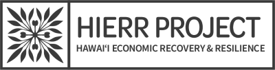

<h1 align="center">Project Hawaiʻi Economic Recovery & Resilience ("HIERR")</h1>

  

	:cherry_blossom:

    
The HIERR Project aims to enable actions toward a more resilient, equitable, and sustainable economy

    <strong>Developed by Code with Aloha</strong>

  <h3>
  	<a href="https://hierr.online/">
      Website
    </a>
     | 
    <a href="https://github.com/CodeforHawaii/HIERR/">
      Repo
    </a>
  </h3>

### Philosophy

The HIERR Project aims to enable actions toward a more resilient, equitable, and sustainable economy. This planning process is designed to learn from the economic impacts and experiences of hardship associated with the COVID-19 pandemic to inform and enable actions toward a more resilient, equitable, and sustainable economy. The HIERR Project will build on both the statewide and county-level goals and objectives for economic development and resilience identified in the Comprehensive Economic Development Strategy ([CEDS](https://planning.hawaii.gov/spb/ceds/)).

### Overall Project Objectives

- Identifying gaps and strategies to mitigate Hawaii's economic vulnerabilities and hardships revealed during the COVID-19 pandemic;
- Compiling specific projects / programs that address the identified gaps;
- Aligning project / program needs to resources and enabling conditions necessary for implementation;
- Advancing pre-disaster economic recovery planning across all hazards.

### What is Pol.is?

https://pol.is/ is an [open source](https://github.com/compdemocracy/polis) engagement platform that identifies areas of consensus. It maps out communities of thought on any given issues, and enables participants to participate in the conversation.

Read more about how Pol.is was used in a case study in Taiwan here: https://blog.pol.is/pol-is-in-taiwan-da7570d372b5

### Code With Aloha Project Focus

The CWA project is focused on developing a digital engagement platform wrapping around Pol.is and onboarding materials to solicit resident sentiments on vision and value statements for Hawaii's economic future. Residents will be invited to in-person workshops for onboarding and introduction to the established Pol.is, where they will be invited to interact with seeded vision and value statements as well as add new ones. The results from this engagement process will be a direct input into the broader HIERR Project by orienting identified strategies and projects for Hawaii's economic resilience to the vision and values statements generating concurrence via Pol.is.

# Attribution

Many thanks to the [The Computational Democracy Project](https://github.com/compdemocracy) for their work on [Pol.is](https://github.com/compdemocracy/polis).

Thanks to the [State of Hawai‘i Office of Planning & Sustainable Development’s (OPSD) Special Plans Branch](https://planning.hawaii.gov/spb/) for being the community partner for this project by providing guidance and hosting the infrastructure for the project.

